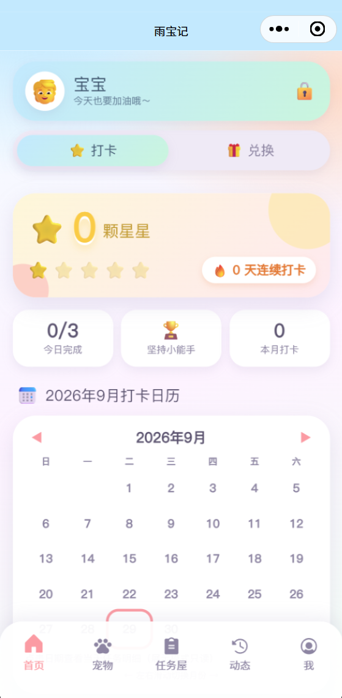
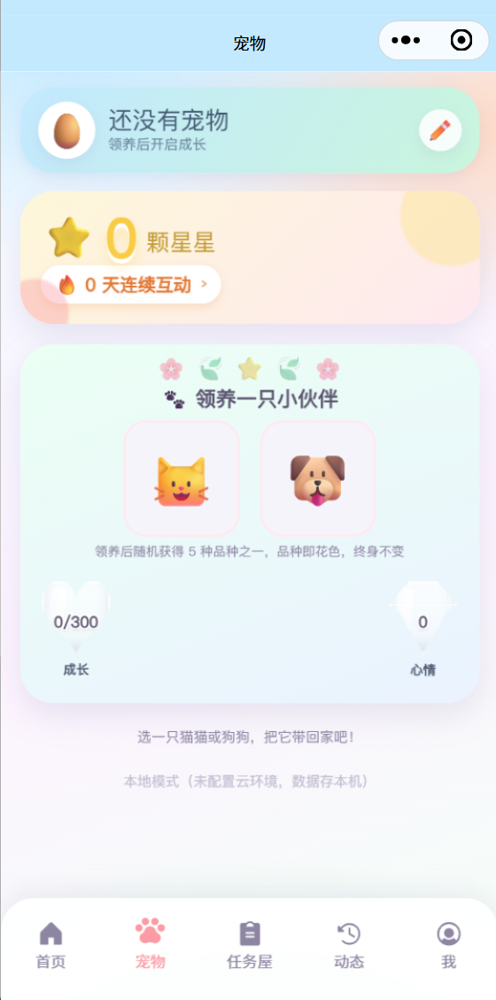
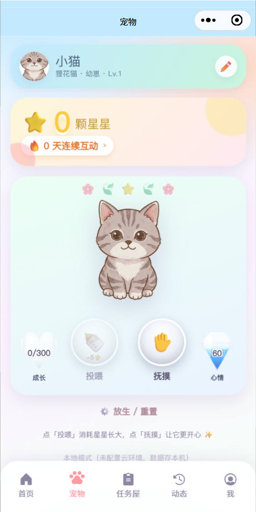

# 雨宝记

> 家庭儿童习惯养成微信小程序 · 家长运营 / 孩子查看双模式

## 项目简介

雨宝记是一款面向家庭的儿童习惯养成工具。家长负责运营（创建宝宝、配置习惯、监督打卡），孩子通过温馨糖果色界面查看成长看板，用「星星」积分兑换奖励，并领养专属虚拟宠物陪伴成长。

原名「小雨记」，2026-09 更名为「雨宝记」。

## 核心功能

- **习惯打卡**：日历式打卡，每日点亮成就，连续打卡有激励
- **星星激励**：打卡累积星星（统一货币），兑换家长设定的奖励
- **双模式**：家长运营模式 / 孩子展示模式，PIN 保护
- **宠物陪伴**：领养猫 / 狗共 10 个品种，投喂 / 抚摸互动，幼崽 → 成年阶段进化
- **宝宝管理**：多宝宝档案、头像相册（选图需隐私授权）
- **本地优先**：默认本地存储兜底，无需后端即可完整运行

## 界面预览

| 首页 · 打卡日历 | 任务屋 |
|---|---|
|  |  |

| 宠物 · 领养 | 宠物 · 投喂 / 抚摸 |
|---|---|
|  |  |

## 技术架构

- 微信原生小程序 + 微信云开发
- **数据层自动路由**：`miniprogram/config.js` 的 `CLOUD_ENV` 为空 → 本地兜底（`wx.storage`）；非空 → 云函数调用
- **双份镜像防漂移**：`miniprogram/utils/pets.js` ↔ `cloudfunctions/lib/pets.js`，配守卫测试与 `npm run sync` 同步至各云函数副本
- **宠物 / 积分**：统一货币「星星」，宠物按 品种 × 阶段 差分 PNG 渲染，HUD 为玻璃瓶进度条

## 目录结构

```
miniprogram/      小程序前端（页面、组件、utils、images）
cloudfunctions/   云函数（与前端 utils 双份镜像，lib/ 自包含）
__tests__/        单元测试与守卫测试（npm test）
tools/            语法检查 / 同步 / 验收脚本
docs/             需求 / 设计 / 方案 / 计划 / 隐私 / 发布文档（不入库）
```

## 本地开发

1. 用微信开发者工具打开本项目根目录（或导入 `miniprogram/`）
2. 默认 **本地模式**（`CLOUD_ENV=''`），无需配置云环境即可运行
3. 常用命令：
   - `npm test` 运行测试
   - `npm run check` 全量语法检查
   - `npm run sync` 同步云函数 lib（仅改动云函数后需要）

## 隐私说明

- 为宝宝设置头像时，会请求《用户隐私保护指引》中「选中的照片或视频信息」授权，仅在你同意后访问相册
- 默认数据存于本地；启用云开发后数据存于你自己的云环境

## 发布状态

- 个人主体小程序，发布前需完成微信小程序备案
- 服务类目：工具 - 效率

## 许可证

本项目仅供个人家庭与学习使用。
